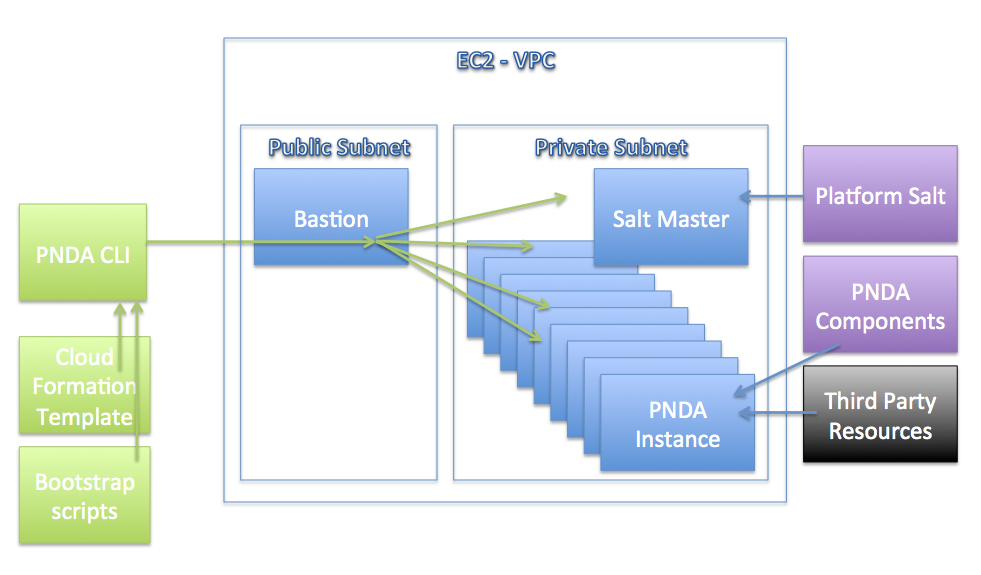

# PNDA AWS Templates
This repository contains resources for launching PNDA on [Amazon Web Services](https://aws.amazon.com/) (AWS).

# Overview



- The blocks in green are provided by this repository.
- Cloud formation templates are used to create the instances and other cloud infrastructure in EC2.
- PNDA is launched in a private network in a custom VPC as specified by the cloud formation templates. For security reasons all access is then controlled via a bastion node, the only one with a public IP address. The CLI generates some sample ssh configuration files to help with accessing the cluster via the bastion.
- The instances are bootstrapped to install the saltstack provisioning system.
- The platform-salt salt scripts are used to install PNDA from PNDA components and third party components.

# Steps to provision PNDA on AWS

## On AWS
1. Obtain an AWS account.
1. Create buckets in S3 for PNDA applications (pnda-apps/releases) and for archived data (pnda-archive). AWS credientials should be created for an IAM user with access to these specific S3 buckets only.

## From a local clone of this repo
1. Edit client_env.sh with [AWS credentials](http://docs.aws.amazon.com/AWSSimpleQueueService/latest/SQSGettingStartedGuide/AWSCredentials.html) and an Ubuntu 14.04 image ID. The AWS credientials should be those created for the IAM user with access to the specific S3 buckets only as these credentials will be stored in plain text on some of the nodes launched in AWS.
1. Edit pnda_env.sh with the package server IP address. A package server provides a webserver for the binaries for the pnda components, the PNDA guide contains instructions on how to set up a package server.
1. Create an ssh keypair to use when creating the EC2 instances for PNDA [(link)](http://docs.aws.amazon.com/AWSEC2/latest/UserGuide/ec2-key-pairs.html) as key_name. Place the private key key_name.pem in the root of the pnda-aws-templates directory.
1. Install pip packages required by the CLI ```pip install -r cli/requirements.txt``` 
1. Load local environment variables ```source client_env.sh```
1. Create a cluster ```cli/pnda-cli.py create -e <cluster_name> -s <key_name> -f standard -o 2 -n 3 -k 2 -z 3```. The options shown select the standard flavour, 2 open tsdb instances, 3 hadoop datanodes, 2 kafka brokers, and 3 zookeeeper nodes.
