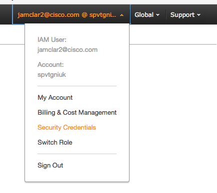
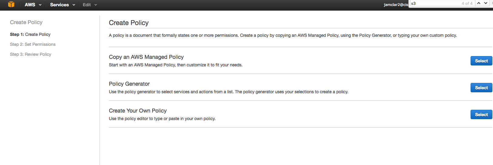
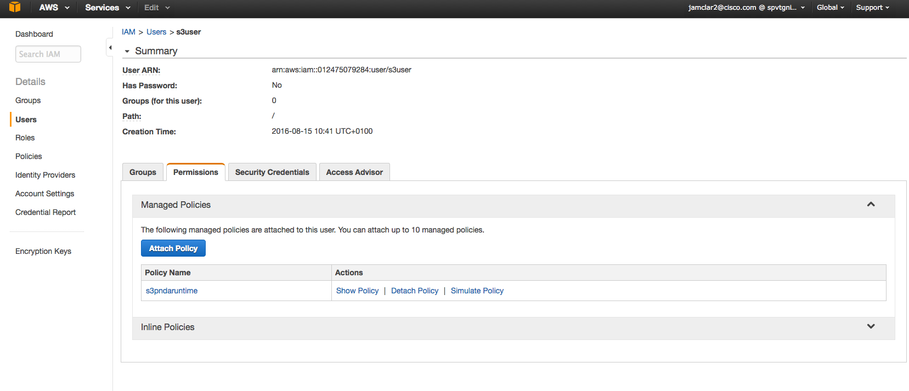

## Creating a user and API key with S3 Access only

As mentioned in the instructions the client_env.sh file should include two sets of AWS credentials:
 - AWS_ACCESS_KEY_ID and AWS_SECRET_ACCESS_KEY: these require access to EC2 and cloud formation for creating PNDA. These keys are only ever stored on the client machine.
 - S3_ACCESS_KEY_ID and S3_SECRET_ACCESS_KEY: these require access to S3, specifically the buckets created for application packages and for archived data.

To create an API key with access only to the specific S3 buckets:

1. Create a new user and record the credentials generated by Amazon


2. Create a new policy with the following contents:



```
{
  "Version": "2012-10-17",
  "Statement": [
    {
      "Effect": "Allow",
      "Action": ["s3:ListBucket"],
      "Resource": ["arn:aws:s3:::pnda-apps"]
    },
    {
      "Effect": "Allow",
      "Action": [
        "s3:PutObject",
        "s3:GetObject",
        "s3:DeleteObject"
      ],
      "Resource": ["arn:aws:s3:::pnda-apps/*"]
    },
    {
      "Effect": "Allow",
      "Action": ["s3:ListBucket"],
      "Resource": ["arn:aws:s3:::pnda-archive"]
    },
    {
      "Effect": "Allow",
      "Action": [
        "s3:PutObject",
        "s3:GetObject",
        "s3:DeleteObject"
      ],
      "Resource": ["arn:aws:s3:::pnda-archive/*"]
    }
  ]
}
```
3. Attach the policy to the user
